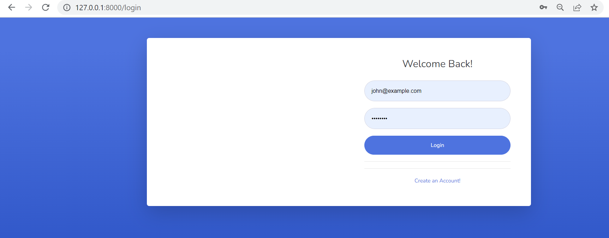
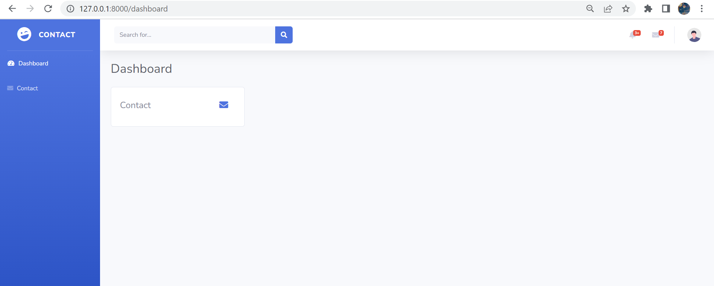
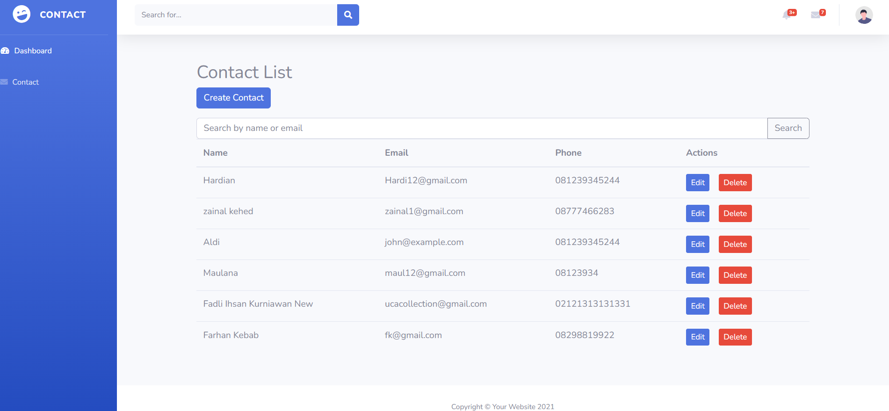
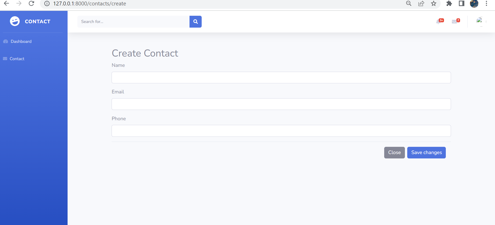
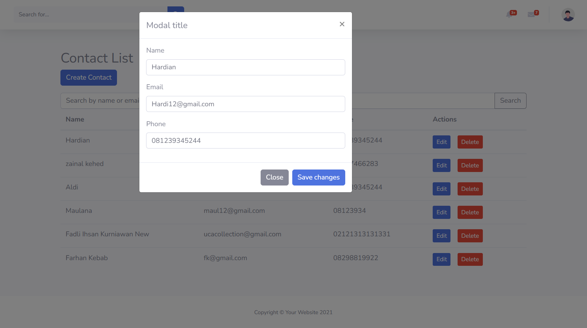
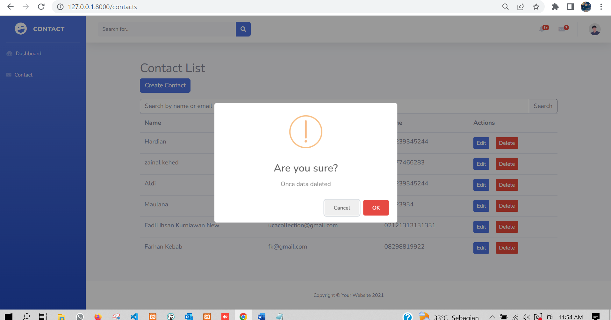

#Dokumentasi Project Contact

    Pastikan Anda memiliki PHP terinstal di komputer Anda. Anda dapat mengunduh dan menginstal PHP dari situs resmi PHP (https://www.php.net/downloads.php). Pastikan Anda menginstal versi PHP yang sesuai dengan persyaratan Laravel (versi 7.4 ke atas direkomendasikan).

<ol>
    <li>
        Instal Composer, manajer dependensi PHP. Composer digunakan untuk mengelola dependensi aplikasi Laravel. Anda dapat mengunduh dan menginstal Composer dari situs resmi Composer (https://getcomposer.org/download/). Pastikan Anda mengatur PATH agar dapat menjalankan perintah Composer dari mana saja di terminal.
    </li>
    <li>
        Buka terminal atau command prompt dan pergi ke direktori tempat Anda ingin menyimpan proyek Laravel Anda.
    </li>
    <li>
        

            Jalankan perintah berikut untuk membuat proyek Laravel baru:
        

        

            Copy code
        

        

            composer create-project --prefer-dist laravel/laravel nama-proyek
        

        

            Gantilah "nama-proyek" dengan nama yang ingin Anda berikan pada proyek Laravel Anda.
        

        

            Setelah selesai, pergi ke direktori proyek Laravel dengan menjalankan perintah:
        

    </li>
    <li>
        

            bash - Copy code
        

        

            cd nama-proyek
        

        

            Salin file .env.example menjadi .env dengan menjalankan perintah
        

    </li>
        

    <li>
            bash - Copy code
        

        

            cp .env.example .env
        

        

            Generate kunci aplikasi dengan menjalankan perintah
        

    </li>
    <li>
        

            Buat database kosong di server database Anda, misalnya MySQL
        

        

            Buka file .env dan atur pengaturan database Anda, termasuk nama database, username, dan password
        

        

            Jalankan migrasi untuk membuat tabel-tabel dasar dengan menjalankan perintah
        

        

            Copy code - php artisan migrate
        

    </li>
        

            Setelah migrasi selesai, Anda dapat menjalankan server pengembangan Laravel dengan perintah
        

    </li>
    <li>
        

            Copy code - php artisan serve
        

        

            Ini akan menjalankan server lokal yang dapat Anda akses melalui browser dengan alamat http://localhost:8000
        

    </li>
    <li>
        

            Halaman Login
        

        
        

            Username: john@example.com
            Password: password
            Sebagai portal/Auth untuk masuk aplikasi Contact
        

    </li>
    <li>
        

            Halaman Dashboard 
        

        

            
        

    </li>
    <li>
        

            Halaman index
        

        

            
        

        

            Berisi Nama,Email, dan telepon serta action Edit Dan Delete
        

    </li>
    <li>
        

            Halaman Create
        

        

            
        

        

            Untuk menambah data Nama,Email dan Telepon
        

    </li>
    <li>
        

            Menu Edit
        

        

            
        

        

            Untuk Mengubah data sesuai kebutuhan
        

    </li>
    <li>
        

            Menu Delete
        

        

            
        

        

            Untuk menghapus Data yang dibutuhkan
        

    </li>
</ol>
